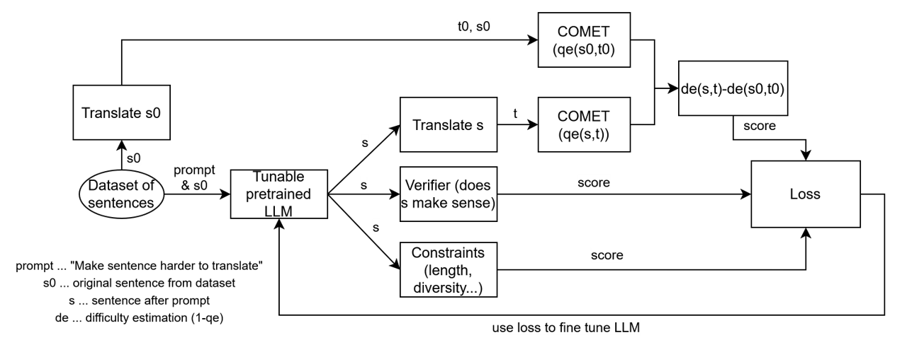

# Breaking-MT
A framework for adversarial machine translation generation and evaluation.

---


## Overview

Breaking-MT is a deep learning framework that automatically generates English sentences which are difficult for machine translation (MT) systems to translate, while ensuring the sentences remain grammatical, natural, and concise.

The project implements three complementary components:

| Component | Description |
|------------|-------------|
| **Method 2 (Reward-based Editing)** | Uses a pretrained language model to rewrite sentences to be harder to translate. Translation difficulty is measured using the COMET Quality Estimation (QE) model, combined with linguistic and constraint-based rewards. |
| **LoRA SFT (Supervised Fine-Tuning)** | Fine-tunes the generator model on the best (prompt → edit) pairs identified by Method 2 using lightweight LoRA adapters. |
| **RL (PPO Fine-Tuning)** | Optimizes the generator directly on a non-differentiable reward signal derived from translation difficulty, linguistic naturalness, and constraints using Proximal Policy Optimization (PPO). |

---

## Environment Setup
```bash
conda env create -f env.yaml
conda activate mtbreaker
```


---

## Project Structure

```
breaking-MT/
├─ env.yaml                        # Conda + pip dependencies
├─ data/
│  ├─ seeds.txt                    # English seed sentences
│  └─ method2_results.jsonl        # Outputs from Method 2
├─ src/
│  ├─ gen_model.py                 # LLM editor for sentence rewriting
│  ├─ translate.py                 # English→German translation wrapper
│  ├─ scorers.py                   # COMET QE + LM verifier
│  ├─ constraints.py               # Length & diversity scoring
│  ├─ losses.py                    # Combined Method 2 loss
│  ├─ method2.py                   # Main pipeline for reward computation
│  ├─ sft_lora.py                  # Supervised fine-tuning using LoRA
│  ├─ ppo_method2.py               # Reinforcement learning (PPO)
│  └─ __init__.py
└─ README.md
```

---

## Usage

### 1. Generate Difficulty Data (Method 2)

Run the main pipeline to:
- Generate sentence edits from a pretrained language model.
- Translate original and edited sentences.
- Compute translation difficulty (1 − QE).
- Calculate the combined loss.

```bash
python -m src.method2 --seeds data/seeds.txt --k 100
```

Output:  
`data/method2_results.jsonl` containing one record per sentence:

```json
{
  "orig": "He saw her duck.",
  "edit": "He observed the bird dive beneath the bridge.",
  "de_old": 0.42,
  "de_new": 0.63,
  "delta_de": 0.21,
  "constraint": 0.37,
  "verify": -2.3,
  "L": 0.43
}
```

---

### 2. Supervised Fine-Tuning (LoRA SFT)

Fine-tune the generator on top low-loss examples from Method 2.

```bash
python -m src.sft_lora \
  --data data/method2_results.jsonl \
  --top_k 300 \
  --require_positive_delta
```

This trains LoRA adapters on the filtered (prompt → edit) pairs.  
Adapters are saved to `checkpoints/gpt2-lora-sft/`.

Example usage after fine-tuning:
```python
from transformers import AutoTokenizer, AutoModelForCausalLM
from peft import PeftModel

base = "gpt2"
model = AutoModelForCausalLM.from_pretrained(base)
model = PeftModel.from_pretrained(model, "checkpoints/gpt2-lora-sft")
tok = AutoTokenizer.from_pretrained(base)
```

---

### 3. Reinforcement Learning (PPO Fine-Tuning)

Optimize the generator directly on the reward (negative Method 2 loss) using PPO.

```bash
python -m src.ppo_method2 \
  --seeds data/seeds.txt \
  --k 100 \
  --steps 200 \
  --batch_size 8
```

The fine-tuned policy is saved to:  
`checkpoints/gpt2-ppo-method2/`

Each PPO step:
1. Generates edits for a batch of prompts.
2. Translates them using the MT model.
3. Computes COMET QE difficulty, LM verification, and constraints.
4. Derives reward = −L.
5. Performs a PPO update to improve the generator.

---

## Loss Function

The core loss combines translation difficulty, linguistic quality, and constraints:


L = 1 - [ x * (de(s,t) - de(s0,t0)) + y * constraint(s) + z * verify(s) ] / (x + y + z)


Where:
- de(s,t) = 1 - QE(s,t): translation difficulty via COMET QE  
- constraint(s): length/diversity regularizer  
- verify(s): language model-based naturalness score  

Lower \(L\) indicates better edits (more difficult to translate yet still natural).

---

