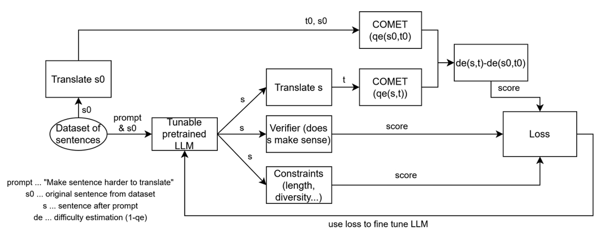

# Breaking-MT
A framework for adversarial machine translation generation and evaluation.

---


## Overview

Breaking-MT is a deep learning framework that automatically generates English sentences which are difficult for machine translation (MT) systems to translate, while ensuring the sentences remain grammatical, natural, and concise.

The project implements three complementary components:

| Component | Description |
|------------|-------------|
| **Method 2 (Reward-based Editing)** | Uses a pretrained language model (GPT-2 or similar) to rewrite sentences to be harder to translate. Translation difficulty is measured using the COMET Quality Estimation (QE) model, combined with linguistic and constraint-based rewards. |
| **LoRA SFT (Supervised Fine-Tuning)** | Fine-tunes the generator model on the best (prompt → edit) pairs identified by Method 2 using lightweight LoRA adapters. Defaults to GPT-2 with LoRA rank 8. |
| **RL (PPO Fine-Tuning)** | Optimizes the generator directly on a non-differentiable reward signal derived from translation difficulty, linguistic naturalness, and constraints using Proximal Policy Optimization (PPO). Now supports Qwen3-0.6B-Base with mixed precision training and gradient checkpointing. |

---

## Key Features

- **Multi-Modal Reward Function**: Combines translation difficulty (COMET QE), linguistic naturalness (LM perplexity), and constraint satisfaction
- **Reference-Free Quality Estimation**: Uses COMET-KIWI for translation quality without requiring reference translations
- **Parameter-Efficient Fine-Tuning**: LoRA adapters for lightweight model adaptation
- **Advanced PPO Implementation**:
  - Mixed precision training (FP16/FP32) for memory efficiency
  - Gradient checkpointing to reduce memory footprint
  - Adaptive KL penalty to prevent policy collapse
  - Configurable device allocation for multi-model inference
- **Weights & Biases Integration**: Comprehensive experiment tracking and model versioning
- **SLURM Support**: Production-ready scripts for HPC cluster deployment
- **Flexible Model Support**: Works with GPT-2, Qwen3, and other causal language models

---

## Environment Setup
```bash
conda env create -f env.yaml
conda activate mtbreaker
```

Note: First run will download pretrained models:
- GPT-2 or Qwen3-0.6B (generator)
- Helsinki-NLP/opus-mt-en-de (translator)
- Unbabel/wmt22-cometkiwi-da (quality estimator)
- distilgpt2 (verifier)


---

## Project Structure

```
breaking-MT/
├─ env.yaml                        # Conda + pip dependencies
├─ run.sh                          # SLURM job script for PPO training
├─ data/
│  ├─ seeds.txt                    # English seed sentences
│  └─ method2_results.jsonl        # Outputs from Method 2
├─ src/
│  ├─ gen_model.py                 # LLM editor for sentence rewriting (GPT-2 default)
│  ├─ translate.py                 # English→German translation (Helsinki-NLP/opus-mt-en-de)
│  ├─ scorers.py                   # COMET QE (wmt22-cometkiwi-da) + LM verifier (distilgpt2)
│  ├─ constraints.py               # Length & lexical diversity scoring
│  ├─ losses.py                    # Combined Method 2 loss function
│  ├─ method2.py                   # Main pipeline for reward computation
│  ├─ sft_lora.py                  # Supervised fine-tuning using LoRA
│  ├─ RL_ppo_training.py           # Reinforcement learning (PPO) with Qwen3/GPT-2
│  └─ __init__.py
├─ checkpoints/
│  ├─ gpt2-lora-sft/               # Saved LoRA adapters from SFT
│  └─ gpt2-ppo-method2/            # Saved PPO policy checkpoints
└─ README.md
```

---

## Recommended Workflow

The three components can be used independently or in sequence:

1. **Exploration Phase** (Method 2):
   - Generate initial difficulty data to understand what makes sentences hard to translate
   - Analyze the loss components to tune weights (x, y, z)
   - Identify promising seed sentences

2. **Supervised Learning Phase** (LoRA SFT):
   - Fine-tune on best Method 2 examples for rapid improvement
   - Faster training than PPO, good for initial model adaptation
   - Use when you have good (prompt → edit) pairs

3. **Reinforcement Learning Phase** (PPO):
   - Direct optimization on the composite reward signal
   - Handles non-differentiable objectives (COMET QE, MT outputs)
   - Best for maximizing final performance
   - Can start from SFT checkpoint or train from scratch

**Quick Start (End-to-End):**
```bash
# Step 1: Generate training data
python -m src.method2 --seeds data/seeds.txt --k 500

# Step 2: Supervised fine-tuning (optional but recommended)
python -m src.sft_lora --data data/method2_results.jsonl --top_k 300

# Step 3: PPO optimization
python -m src.RL_ppo_training --seeds data/seeds.txt --k 200 --steps 300 --batch_size 2
```

---

## Usage

### Data Preparation

Prepare your seed sentences in `data/seeds.txt` (one sentence per line). The repository includes a sample dataset with simple English sentences designed to be easy to translate initially.

Example seed sentences:
```
A beautiful bird sings happily.
He saw her duck.
The bank is by the river.
```

### 1. Generate Difficulty Data (Method 2)

Run the main pipeline to:
- Generate sentence edits from a pretrained language model (GPT-2)
- Translate original and edited sentences (EN→DE)
- Compute translation difficulty using COMET QE (1 − QE)
- Calculate constraint scores (length and diversity)
- Evaluate linguistic naturalness with LM verifier
- Compute the combined loss

```bash
python -m src.method2 --seeds data/seeds.txt --k 100
```

**Parameters:**
- `--seeds`: Path to seed sentences file
- `--k`: Number of seeds to process (default: 100)
- `--instruction`: Custom instruction for editing (optional)
- `--x/--y/--z`: Loss weights (defaults: 1.0, 0.3, 0.3)
- `--f`: Delta transformation function (choices: relu, sigmoid, none)
- `--out`: Output file path (default: data/method2_results.jsonl)

Output:
`data/method2_results.jsonl` containing one record per sentence:

```json
{
  "orig": "He saw her duck.",
  "edit": "He observed the bird dive beneath the bridge.",
  "de_old": 0.42,
  "de_new": 0.63,
  "delta_de": 0.21,
  "constraint": 0.37,
  "verify": -2.3,
  "L": 0.43
}
```

---

### 2. Supervised Fine-Tuning (LoRA SFT)

Fine-tune the generator on the best (lowest loss) examples from Method 2 using parameter-efficient LoRA adapters.

```bash
python -m src.sft_lora \
  --data data/method2_results.jsonl \
  --top_k 300 \
  --require_positive_delta
```

**Parameters:**
- `--data`: Path to Method 2 results JSONL file
- `--top_k`: Number of best examples to use (default: 300)
- `--require_positive_delta`: Only use examples where delta_de > 0 (default: True)
- `--base_model`: Base model to fine-tune (default: "gpt2")
- `--outdir`: Output directory for adapters (default: checkpoints/gpt2-lora-sft)
- `--max_length`: Max sequence length (default: 256)
- `--epochs`: Training epochs (default: 2)
- `--lr`: Learning rate (default: 2e-4)
- `--batch_size`: Batch size per device (default: 8)
- `--grad_accum`: Gradient accumulation steps (default: 2)

**Training Details:**
- Uses LoRA with rank=8, alpha=16, dropout=0.05
- Targets attention layers (`c_attn`, `c_proj`) for GPT-2
- Only computes loss on the target (edited) sequence, not the prompt
- Automatic FP16 training on GPU for memory efficiency
- Saves only the lightweight LoRA adapter weights (~few MB)

Adapters are saved to `checkpoints/gpt2-lora-sft/`.

**Example usage after fine-tuning:**
```python
from transformers import AutoTokenizer, AutoModelForCausalLM
from peft import PeftModel

base = "gpt2"
model = AutoModelForCausalLM.from_pretrained(base)
model = PeftModel.from_pretrained(model, "checkpoints/gpt2-lora-sft")
tok = AutoTokenizer.from_pretrained(base)

# Generate with the fine-tuned model
prompt = "Make the following sentence harder to translate while keeping it grammatical and natural.\n\n'He saw her duck.'\n\nRewrite it as one grammatical English sentence."
inputs = tok(prompt, return_tensors="pt")
outputs = model.generate(**inputs, max_new_tokens=40, do_sample=True, top_p=0.95, temperature=0.9)
print(tok.decode(outputs[0], skip_special_tokens=True))
```

---

### 3. Reinforcement Learning (PPO Fine-Tuning)

Optimize the generator directly on the reward (negative Method 2 loss) using PPO. The implementation supports multiple base models and includes optimizations for memory-constrained GPUs.

#### Basic Usage

```bash
python -m src.RL_ppo_training \
  --seeds data/seeds.txt \
  --k 200 \
  --steps 300 \
  --batch_size 2 \
  --temperature 0.7
```

#### Advanced Options

```bash
python -m src.RL_ppo_training \
  --seeds data/seeds.txt \
  --k 500 \
  --base_model "Qwen/Qwen3-0.6B-Base" \
  --save_dir checkpoints/qwen3-ppo \
  --steps 200 \
  --batch_size 2 \
  --gen_max_new_tokens 64 \
  --top_p 0.8 \
  --temperature 0.4 \
  --mt_device cuda \
  --lm_verifier_device cuda \
  --comet_accelerator gpu \
  --x 1.0 --y 0.3 --z 0.3 \
  --f none \
  --wandb_project mt-breaker-ppo \
  --wandb_run_name my-experiment
```

#### Key Parameters

- `--base_model`: Base model for policy (default: "Qwen/Qwen3-0.6B-Base", also supports "gpt2")
- `--batch_size`: Prompts per PPO step (default: 2, optimized for memory efficiency)
- `--gen_max_new_tokens`: Maximum tokens to generate (default: 64)
- `--temperature`: Sampling temperature (default: 0.7 for Qwen3, higher = more diverse)
- `--top_p`: Nucleus sampling threshold (default: 0.8 for Qwen3)
- `--mt_device/--lm_verifier_device/--comet_accelerator`: Device allocation for different models
- `--x/--y/--z`: Loss weights for difficulty delta, constraints, and verification
- `--f`: Transformation function for delta ("relu", "sigmoid", or "none")
- `--no_wandb`: Disable Weights & Biases logging

#### SLURM Cluster Usage

For training on HPC clusters with SLURM:

```bash
sbatch run.sh
```

The provided [run.sh](run.sh) script includes:
- GPU allocation (1080ti:1)
- CUDA module loading
- Environment activation
- Optimized hyperparameters for production runs

#### Memory Optimizations

The PPO implementation includes several memory-saving features:
- **Mixed Precision Training**: Automatic FP16 training on GPU to reduce memory usage
- **Gradient Checkpointing**: Trades compute for memory during backpropagation
- **Mini-batch Processing**: Processes one sample at a time during PPO updates
- **Periodic Cache Clearing**: Clears CUDA cache to prevent memory fragmentation
- **Device-specific Allocation**: Can run MT/scorers on CPU while training on GPU

#### Weights & Biases Integration

The training script automatically logs:
- Reward metrics (mean, min, max, individual components)
- PPO training statistics (loss, KL divergence, policy entropy)
- Generation statistics (response length, sample outputs)
- Model hyperparameters and configuration
- Final model artifacts

The fine-tuned policy is saved to `checkpoints/gpt2-ppo-method2/` (or your specified `--save_dir`)

#### PPO Training Loop

Each PPO step:
1. Samples a batch of seed sentences and builds instruction prompts
2. Generates edited sentences using the current policy
3. Translates originals and edits using the MT model
4. Computes COMET QE difficulty, LM verification scores, and constraint scores
5. Calculates reward = −L (negative loss, higher is better)
6. Performs PPO update with KL penalty to prevent policy divergence
7. Saves checkpoints every 20 steps

---

## Loss Function

The core loss combines translation difficulty, linguistic quality, and constraints:

```
L = 1 - [ x * f(de(s,t) - de(s0,t0)) + y * constraint(s) + z * verify(s) ] / (x + y + z)
```

Where:
- **de(s,t) = 1 - QE(s,t)**: Translation difficulty via COMET QE (wmt22-cometkiwi-da)
  - Higher difficulty = harder to translate
  - Reference-free quality estimation
- **constraint(s)**: Length and lexical diversity regularizer
  - Rewards sentences within length bounds (4-1024 tokens)
  - Penalizes low lexical diversity (repeated words)
- **verify(s)**: Language model-based naturalness score (distilgpt2)
  - Uses negative perplexity as naturalness proxy
  - Higher score = more grammatical/natural
- **f()**: Optional transformation function
  - `relu`: Only reward positive difficulty delta (max(0, delta))
  - `sigmoid`: Smooth transformation of delta
  - `none`: Use raw delta
- **x, y, z**: Tunable weights (defaults: x=1.0, y=0.3, z=0.3)

Lower L indicates better edits (more difficult to translate yet still natural and diverse).

### Component Models

| Component | Model | Purpose |
|-----------|-------|---------|
| Generator (Method 2) | GPT-2 | Initial sentence editing |
| Generator (PPO) | Qwen/Qwen3-0.6B-Base | Policy for RL training |
| MT System | Helsinki-NLP/opus-mt-en-de | English→German translation |
| Quality Estimator | Unbabel/wmt22-cometkiwi-da | Reference-free translation quality |
| Verifier | distilgpt2 | Grammaticality/naturalness scoring |

---

## Model Loading and Inference

### Using LoRA Fine-tuned Model

After training with LoRA SFT:

```python
from transformers import AutoModelForCausalLM, AutoTokenizer
from peft import PeftModel

base_model = "gpt2"
adapter_path = "checkpoints/gpt2-lora-sft"

model = AutoModelForCausalLM.from_pretrained(base_model)
model = PeftModel.from_pretrained(model, adapter_path)
tokenizer = AutoTokenizer.from_pretrained(base_model)

prompt = "Make the following sentence harder to translate while keeping it grammatical and natural.\n\n'He saw her duck.'\n\nRewrite it as one grammatical English sentence."
inputs = tokenizer(prompt, return_tensors="pt")
outputs = model.generate(**inputs, do_sample=True, top_p=0.95, temperature=0.9, max_new_tokens=40)
print(tokenizer.decode(outputs[0], skip_special_tokens=True))
```

### Using PPO Fine-tuned Model

After training with PPO:

```python
from transformers import AutoTokenizer
from trl import AutoModelForCausalLMWithValueHead

model_path = "checkpoints/gpt2-ppo-method2"
tokenizer = AutoTokenizer.from_pretrained("Qwen/Qwen3-0.6B-Base")

model = AutoModelForCausalLMWithValueHead.from_pretrained(model_path)
model.eval()

prompt = 'Rewrite this sentence to be extremely difficult for machine translation using idioms, ambiguity, and wordplay, while keeping it grammatically correct English: "The cat sat on the mat."\n\nOnly return the single edited sentence.'
inputs = tokenizer(prompt, return_tensors="pt")
outputs = model.generate(**inputs, do_sample=True, top_p=0.8, temperature=0.7, max_new_tokens=64)
print(tokenizer.decode(outputs[0], skip_special_tokens=True))
```

---

## Dependencies

Key packages (see [env.yaml](env.yaml) for complete list):

- Python 3.10
- PyTorch 2.4.* with CUDA 12.1
- Transformers 4.44.2
- TRL 0.8.6 (PPO implementation)
- PEFT 0.12.0 (LoRA)
- Unbabel-COMET 2.2.2 (Quality Estimation)
- Accelerate 0.34.2 (distributed training)
- Weights & Biases (optional, for experiment tracking)

---

## Hardware Requirements & Performance

### Minimum Requirements

**Method 2 & LoRA SFT:**
- GPU: 6GB VRAM (GTX 1060, RTX 2060)
- RAM: 16GB
- Storage: 10GB for models and data

**PPO Training:**
- GPU: 11GB VRAM (GTX 1080 Ti, RTX 2080 Ti, RTX 3080)
- RAM: 32GB recommended
- Storage: 20GB for models, checkpoints, and cache

### Performance Benchmarks

**Training Speed (on GTX 1080 Ti):**
- Method 2: ~100 sentences in 10-15 minutes
- LoRA SFT: ~300 examples, 2 epochs in 15-20 minutes
- PPO: ~200 steps with batch_size=2 in 2-3 hours

**Memory Usage (PPO with Qwen3-0.6B):**
- Policy model: ~1.2GB (FP32) or ~600MB (FP16)
- Reference model: ~1.2GB (frozen copy)
- MT model (EN-DE): ~300MB
- COMET QE: ~2GB
- LM Verifier: ~250MB
- **Total: ~10-11GB VRAM** (with mixed precision and gradient checkpointing)

**Optimization Tips:**
- Use `--batch_size 1` for 8GB GPUs
- Set `--mt_device cpu` to save ~300MB VRAM
- Set `--lm_verifier_device cpu` to save ~250MB VRAM
- Reduce `--gen_max_new_tokens` to 32-48 for faster generation
- Use `--base_model gpt2` (smaller model) instead of Qwen3

---

## Troubleshooting & Testing

The repository includes several utility scripts for debugging and validation:

### Check Tokenizer

Verify tokenizer functionality and encoding/decoding:

```bash
python check_tokenizer.py
```

### Test Model Inference

Test basic model inference before training:

```bash
python test_model_inference.py
```

Or use the SLURM script:

```bash
bash test_model.sh
```

### Verify Generation

Verify GPT-2 generation quality and outputs:

```bash
bash verify.sh
# or
python verify_gpt2_generation.py
```

### Common Issues

**Out of Memory (OOM) Errors during PPO Training:**
- Reduce `--batch_size` (try 1 or 2)
- Reduce `--gen_max_new_tokens` (try 32 or 48)
- Set `--mt_device cpu` to offload translation to CPU
- Set `--lm_verifier_device cpu` to offload verifier to CPU
- Use `--comet_accelerator cpu` if GPU memory is tight

**COMET QE fails to load:**
- Check internet connection (first run downloads model)
- Try `--comet_accelerator cpu` to force CPU mode
- Ensure unbabel-comet==2.2.2 is installed

**Generation produces empty outputs:**
- Check `--temperature` (too low may cause degenerate outputs)
- Increase `--min_new_tokens` in generation config
- Verify base model loads correctly with test scripts

**WandB logging errors:**
- Use `--no_wandb` to disable if not needed
- Ensure wandb is installed and logged in: `wandb login`

---

## Citation

If you use this code in your research, please cite:

```bibtex
@software{breaking-mt-2024,
  title={Breaking-MT: Adversarial Machine Translation Generation Framework},
  author={Your Name},
  year={2024},
  url={https://github.com/yourusername/breaking-mt}
}
```

---

## License

This project is released under the MIT License.

---

